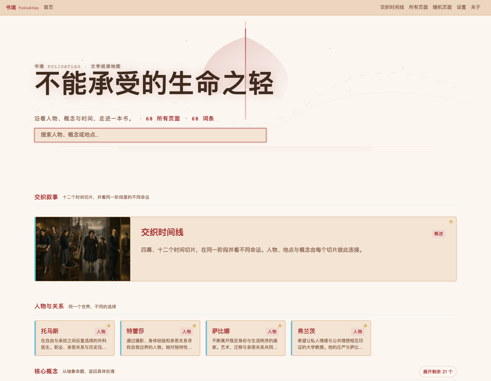
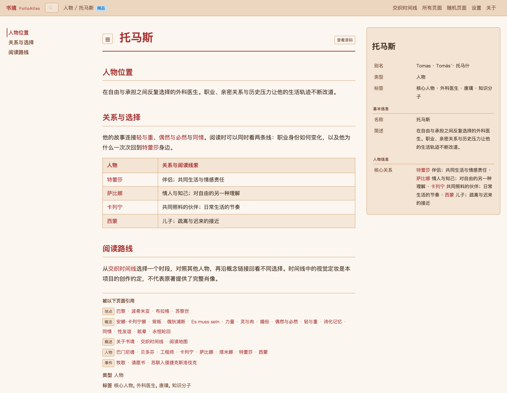
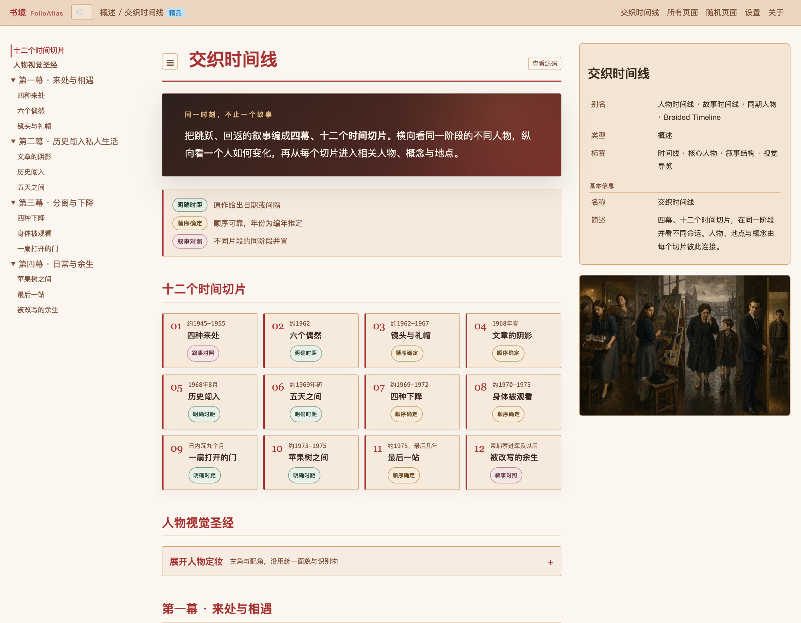
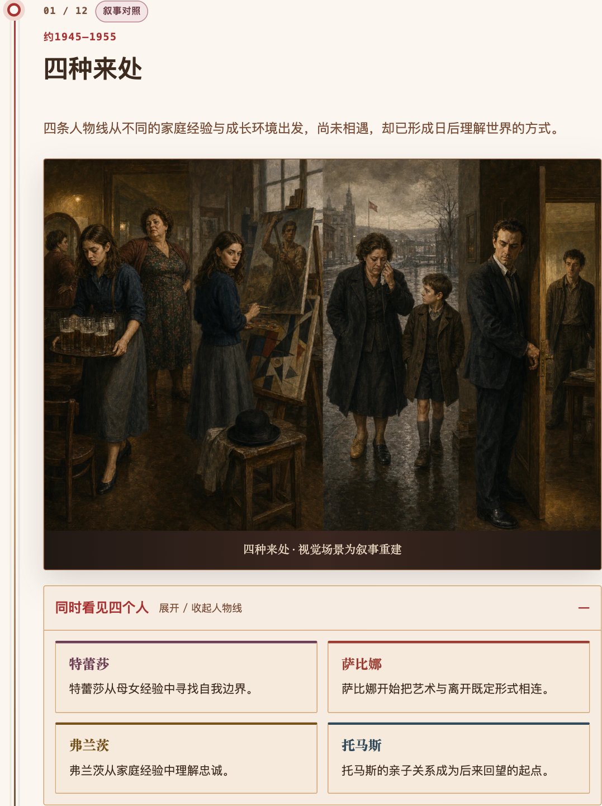

<div align="center">

# 书境 · FolioAtlas

**沿着人物、概念与时间，走进一本书。**

A book becomes a world you can explore.

[在线体验](https://ruilin-mmwa.github.io/folio-atlas/) · [交织时间线](https://ruilin-mmwa.github.io/folio-atlas/wiki/#交织时间线) · [本地运行](#本地运行) · [作者与来源](#作者与来源)

</div>



书境是一个把长文本转成可探索知识空间的阅读产品。这个作品以米兰·昆德拉《不能承受的生命之轻》为例，将人物关系、核心概念、地点与事件组织到同一套 Wiki 中，再用四幕、十二个时间切片，展开章节顺序之外的阅读路径。

这个公开版本沿用已经完成的 Wiki 界面和本地扩展，提供 **68 个公开知识页面 · 4 幕 12 个时间切片 · 人物关系与叙事视觉**。截图均来自本仓库实际运行的公开演示。

## 一次阅读，三条路径

| 想弄清楚什么 | 可以怎样探索 |
|---|---|
| 这个人为何做出这样的选择？ | 从人物词条进入关系卡片，再沿概念和事件继续阅读。 |
| 同一时期，其他人在哪里？ | 在交织时间线中展开四条人物线，并看相同阶段的不同处境。 |
| 抽象概念如何进入生活？ | 从“轻与重”“媚俗”“偶然与必然”等概念返回人物与关系。 |

### 人物不是孤立的词条

每个角色都放回关系与选择之中。词条双链、关系表和信息框共同提供阅读入口；点击关系中的姓名，就能进入另一个人的视角，继续探索共同的事件与概念。



### 同一时刻，不止一个故事

小说的叙事不断回返。交织时间线将它重新组织为四幕十二个切片，允许横向比对人物，也允许纵向追踪变化。**明确时距、顺序确定、叙事对照**三类标记，区分原作证据、编年推定和视觉并置。





### 让视觉延续同一个世界

四位主角与配角使用统一定妆和识别物；十二幅场景与两幅人物设定，共同沿用一套视觉约定。职业、动作和标志物来自阅读分析；发色、精确脸型等属于创作设定。画面是 AI 辅助生成的叙事重建，不是原著插图。

<details>
<summary>展开人物视觉设定</summary>


</details>

## 产品设计中的几个判断

- **先建立可导航的知识结构。** 将人物、概念、地点和事件分型，保留别名、关系与交叉链接。读者不必从第一章重新开始，也能找到清晰的入口。
- **用叙事组织补足百科的局限。** 单独的词条适合查找；时间切片适合解释不同人物如何在相同背景下走向不同结果。
- **明确事实与解释的边界。** 同期不等于同日，视觉并置不等于真实同场；标签直接出现在阅读界面里。
- **将生成结果交付成可用体验。** 保持人物视觉一致性，修复关系对象显示问题，检查导航和布局，而不把内容生成当作结束。

## 从书页到阅读空间


本地完整版整理了 **77 个页面与 5,703 条句级索引**。公开演示移除了 9 个原文章节，并将其余页面整理为概要，保留知识导航和叙事体验。

## 本地运行

需要 Python 3 和联网浏览器。页面是静态文件，无须数据库、API Key 或前端构建。

```bash
git clone https://github.com/Ruilin-mmwa/folio-atlas.git
cd folio-atlas
python3 -m http.server 8000 --directory docs
```

打开 [http://localhost:8000/wiki/](http://localhost:8000/wiki/)。

编辑公开概要后，重新生成索引并校验链接：

```bash
python3 scripts/build_index.py
python3 scripts/check_public_bundle.py
```

页面通过外部 CDN 加载 **Memex** 运行时及浏览器依赖，因而本地运行也需要网络。主引擎 JS/CSS 固定为已验证的构建，插件仍依赖上游 CDN。仓库提供 GitHub Pages 工作流；启用 Pages 的 GitHub Actions 来源后即可部署 `docs/`。

## 仓库导览

```text
folio-atlas/
├── docs/wiki/
│   ├── index.html          真实 Wiki 入口与运行时集成
│   ├── local/              主题、首页配置、关系渲染修复
│   ├── pages/              精编词条与交织时间线
│   ├── images/timeline/    自有生成视觉
│   └── *.json              公开词条索引与反向链接
├── assets/screenshots/     本公开版本的真实浏览器截图
├── scripts/               索引生成与公开包校验
└── .github/workflows/      GitHub Pages 部署
```

## 作者与来源

**蔡睿麟 · [Ruilin-mmwa](https://github.com/Ruilin-mmwa)**

我负责本项目的知识结构设计、人物与叙事组织、视觉一致性设计、内容校核、本地定制及交付，与 Claude Code / Codex 协作实现。书境所用的底层 Wiki 路由、Markdown 渲染、检索和插件机制来自 **Memex**，不是本项目从零实现的通用引擎。

公开仓库只包含项目定制、精编概要和自有生成视觉。小说译本、章节全文、句级索引、全文搜索索引、来源未核实的书封面以及内部运行记录均不在公开包中。原作品及第三方组件的权利归各自权利人；详见 [ATTRIBUTION.md](ATTRIBUTION.md)。
