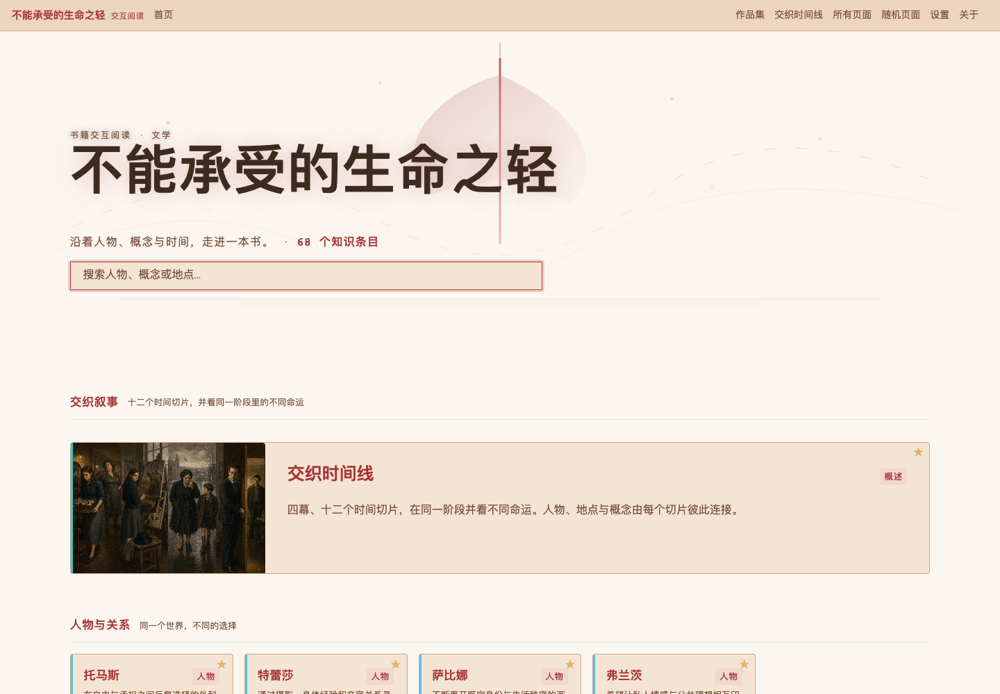
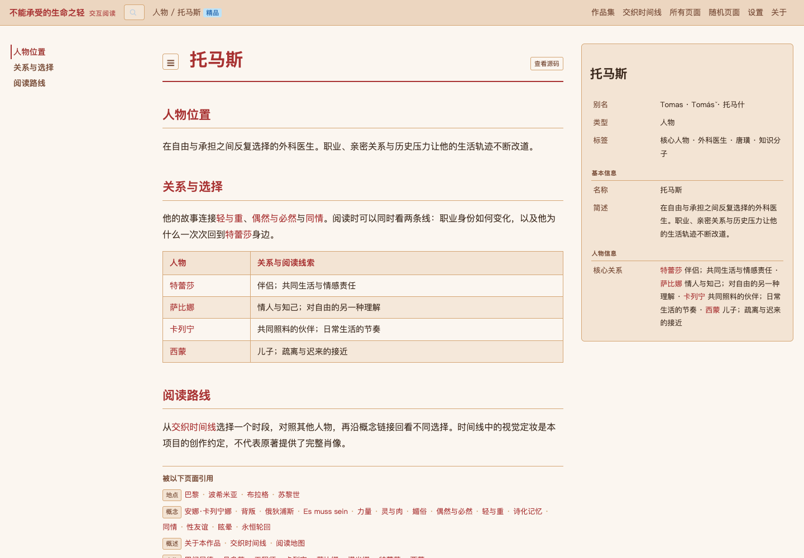
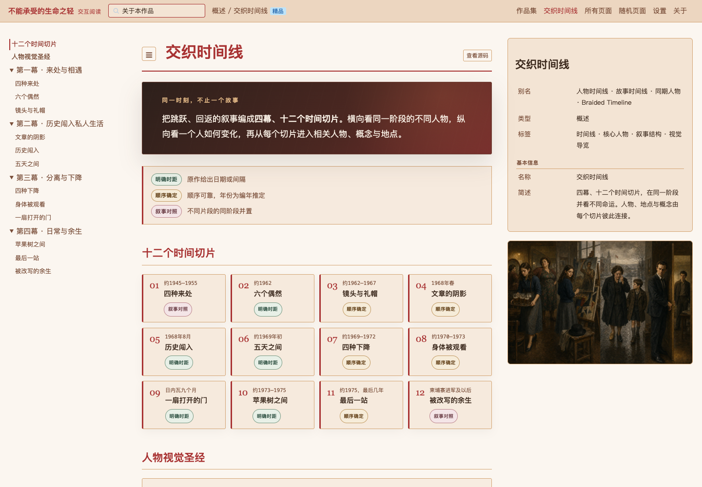
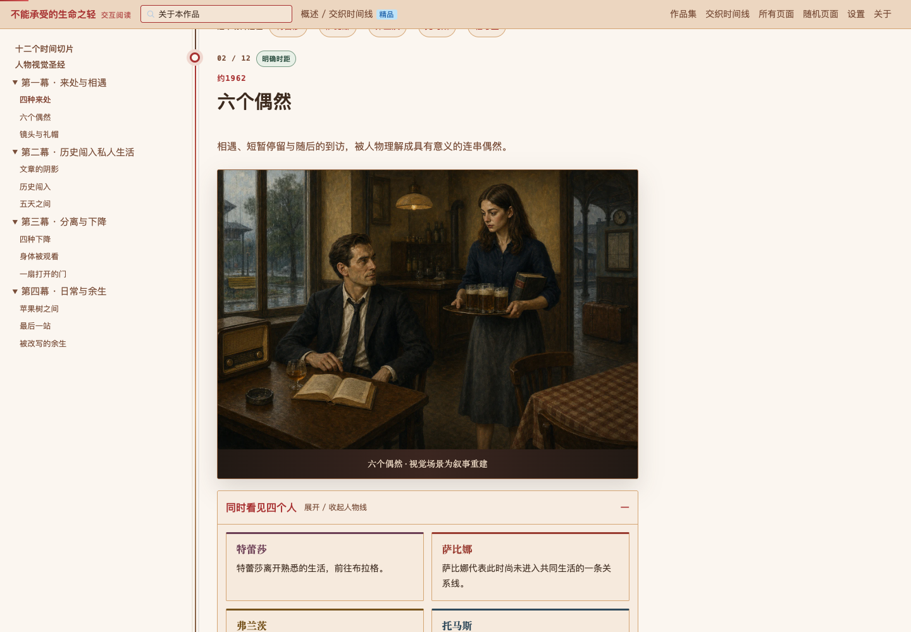
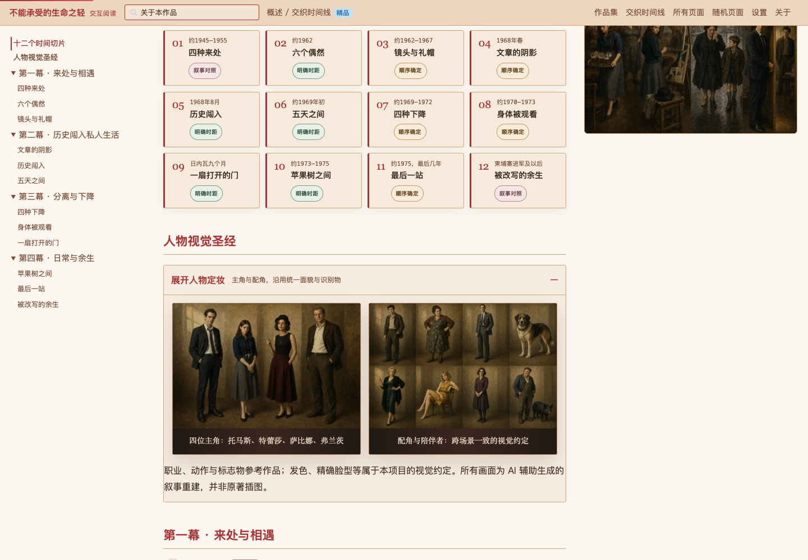

# 书籍交互阅读作品集

把书中的人物、概念与事件组织成可以探索的阅读体验。

**[打开作品集](https://ruilin-mmwa.github.io/folio-atlas/) · [体验《不能承受的生命之轻》](https://ruilin-mmwa.github.io/folio-atlas/wiki/)**

作者：蔡睿麟 · [Ruilin-mmwa](https://github.com/Ruilin-mmwa)

## 系列作品

本系列包含四本书。这里展开《不能承受的生命之轻》的制作过程，其他作品只提供入口。

| 作品 | 入口 |
|---|---|
| 不能承受的生命之轻 | [在线演示](https://ruilin-mmwa.github.io/folio-atlas/wiki/) · 下方制作详情 |
| 鱼不存在 | [阅读概要](https://ruilin-mmwa.github.io/folio-atlas/works/fish/) |
| 女士品茶 | [阅读概要](https://ruilin-mmwa.github.io/folio-atlas/works/tea/) |
| 如何成为你 | [阅读概要](https://ruilin-mmwa.github.io/folio-atlas/works/becoming/) |

## 完整案例：不能承受的生命之轻

米兰·昆德拉的小说不断在时间与人物视角之间回返。我把内容组织为人物、概念、地点和事件，再建立相互跳转的关系与四幕十二个时间切片，让读者可以沿自己的问题继续阅读。



### 1. 先建立能继续探索的知识结构

人物、概念、地点和事件各有词条，保留类型、别名及交叉链接。人物页展示核心关系：从托马斯可以进入特蕾莎、萨比娜，也可以回到“轻与重”“偶然与必然”等概念。

设计关注的是：找到一个词条以后，读者还能自然地走向哪里。



### 2. 用交织时间线补足词条的局限

独立词条适合查找，却不容易呈现人物如何变化。四幕、十二个时间切片并列托马斯、特蕾莎、萨比娜、弗兰茨四条路径，支持同一阶段的横向比较和单个人物的纵向追踪。

界面用“明确时距”“顺序确定”“叙事对照”标明时间关系：同期不等于同日，视觉并置也不等于原作中的真实同场。



### 3. 先确定人物设定，再制作叙事视觉

先建立四位主角和配角的视觉约定，再在不同场景中复用角色面貌与识别物。十二幅场景图与两幅设定图共同组成视觉资产。

职业和标志物参考原作；发色、精确脸型、部分场景并置属于视觉创作。制作中逐场检查角色一致性，也修订过人物重复出现、书页上残留可读字母等具体问题。



<details>
<summary>查看人物视觉设定</summary>



</details>

### 制作流程

1. **梳理原作：** 整理章节和证据定位，区分明确事实与编年推定。
2. **建立结构：** 设计词条类型、别名、关系和交叉链接，并校核内容。
3. **组织叙事：** 编排四幕十二个切片，对照不同人物的处境。
4. **制作视觉：** 确定人物设定，生成、检查并修订场景图。
5. **接入交互：** 定制首页、人物关系卡片、时间线和导航。
6. **整理展示：** 保留概要、关系和叙事视觉，制作独立的作品集入口。

### 当前展示范围

| 内容 | 数量或范围 |
|---|---|
| 公开知识页面 | 68 个 |
| 交织时间线 | 4 幕、12 个时间切片 |
| 主要视觉资产 | 12 幅场景图、2 幅人物设定图 |
| 本地研究材料 | 77 个页面、5,703 条原句索引；原句索引不在公开演示中 |

截图来自本项目实际运行界面。公开演示提供精编概要，不分发小说译本、原文章节或用于重建全文的索引。

## 我的工作与技术来源

我负责知识结构设计、人物与叙事组织、视觉一致性、内容校核、本地定制及展示交付，与 Claude Code / Codex 协作实现，视觉使用 AI 辅助生成。

底层 Wiki 的路由、Markdown 渲染、检索及插件机制来自 **Memex**。项目贡献聚焦具体内容的产品组织与定制，不将通用引擎计为本人从零开发。详见 [来源说明](ATTRIBUTION.md)。

## 本地查看

```bash
python3 -m http.server 8000 --directory docs
```

打开 [http://localhost:8000/](http://localhost:8000/) 查看作品集，或进入 `/wiki/` 体验主案例。作品集页面使用本地静态资源；Wiki 演示依赖外部 Memex 运行时和 CDN，需要联网。

编辑主案例公开词条后，可以重建索引并检查内容与链接：

```bash
python3 scripts/build_index.py
python3 scripts/check_public_bundle.py
```

`docs/index.html` 为作品集入口；`docs/wiki/` 为主案例；`docs/assets/screenshots/` 保存真实截图。GitHub Pages 发布 `docs/`。
